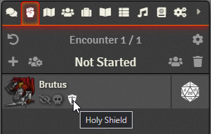

# FVTT | Combat Tracker Effect Icon Tooltips

Adds tool tips to the effect icons shown on tokens in the combat tracker.
It uses the filename of the effect icon to generate the tool tip (split on `-`, `_`, `.` and space, then Title Case), however if CUB Enhanced Conditions is enabled, it will use the CUB condition name.

## License

Licensed under the GPLv3 License (see [LICENSE](LICENSE)).
